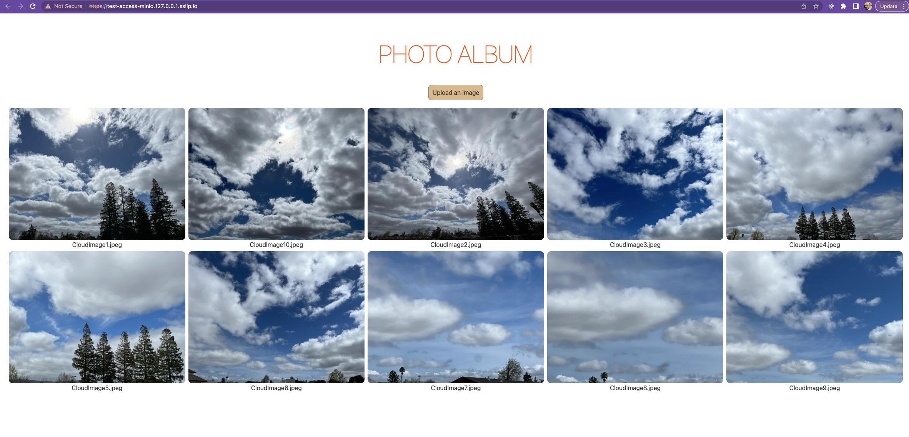

# Sample App: Photo Album

The folder contains an [Epinio](https://epinio.io/) app that uses the minio service to store images and then displays them in a simple photo album UI. The app uses Python with [Flask](https://flask.palletsprojects.com/en/2.2.x/) and [Boto3](https://boto3.amazonaws.com/v1/documentation/api/latest/reference/services/s3.html) for the backend and Svelte for the UI.

## Building and deploying the service and app

The commands for building the Minio service and the sample app are specified in the Makefile. In order to build and deploy everything in one step, use

```
make deploy
```

This will create a minio service named `devMinio` and the test app named `test-access-minio` in namespace (target) `test-minio-namespace`. You can change those names by prefixing the make command with corresponding environment variable settings, e.g.

```
SERVICENAME=my-minio APPNAME=my-app NAMESPACE=my-namespace make deploy
```

If everything works as expected, you can visit the url that is shown at the end of the deploy output, e.g. https://test-access-minio.127.0.0.1.sslip.io/. After uploading a few images, the UI should look something like this:



Also works with non-cloud images 😉 (credits for the photos go to my friend [@waelsv](https://github.com/waelsv)!)

If you have the aws-cli setup running, you can also check that a bucket with the name `<conf-name>.<namespace>.s3.bucket` has been created and that it contains the image files you've uploaded. (`conf-name` refers to the name of the configuration created for the service by epinio).
